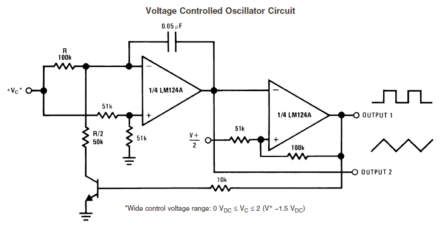
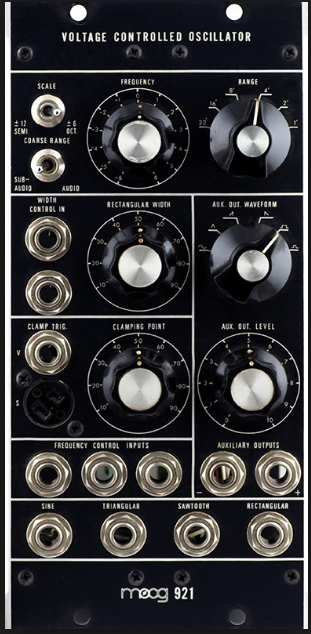
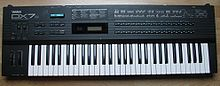

# Analogic Age

In 1964, Bob Moog met Herbert Deutsch and created the first voltage controlled oscillator and amplifier module with a keyboard.
THe first [MOOG](https://www.moogmusic.com/) was born.

Years later, the moog system was a great success and a big community of hackers had formed around it. 

One of them ([Dieter Döpfer](https://en.wikipedia.org/wiki/Doepfer)) created the [Eurorack](https://en.wikipedia.org/wiki/Eurorack) modular system.
This system is a backplane in a box housing cards plugged on the bus and powered by it. 

Modules plugged in it provide a wide range of functtionality like:
 - Voltage Controlled Oscillator
 - Voltage Controled amplifiers
 - Voltage controlled filters,
 - sequencers
 - ...

# Digital Age

Beginning of 1980 years, synthetizer became digital 
The main difference is that digital synthetizer are working with digital circuitry instead of analog circuitry.

Digital signal processors are running algorithms that emulate the inner working of the analog synthetizers.

Digital synths are a lot cheaper to produce and able to support a vast set of sounds and synthesis algorithms.

Today's digital syntherizers are a lot more powerful 

# Computer Era
Today, a lot of suynthetizers can be emulated on computers (mainly on Windows)
Note that while they provide a lot of functionalities and are very compact ( software doesn't take any space), 
they also don't provide the same level of real-time control and ease of control.

They are mainly useful for production purpose where realtime control isn't a primary constraint.